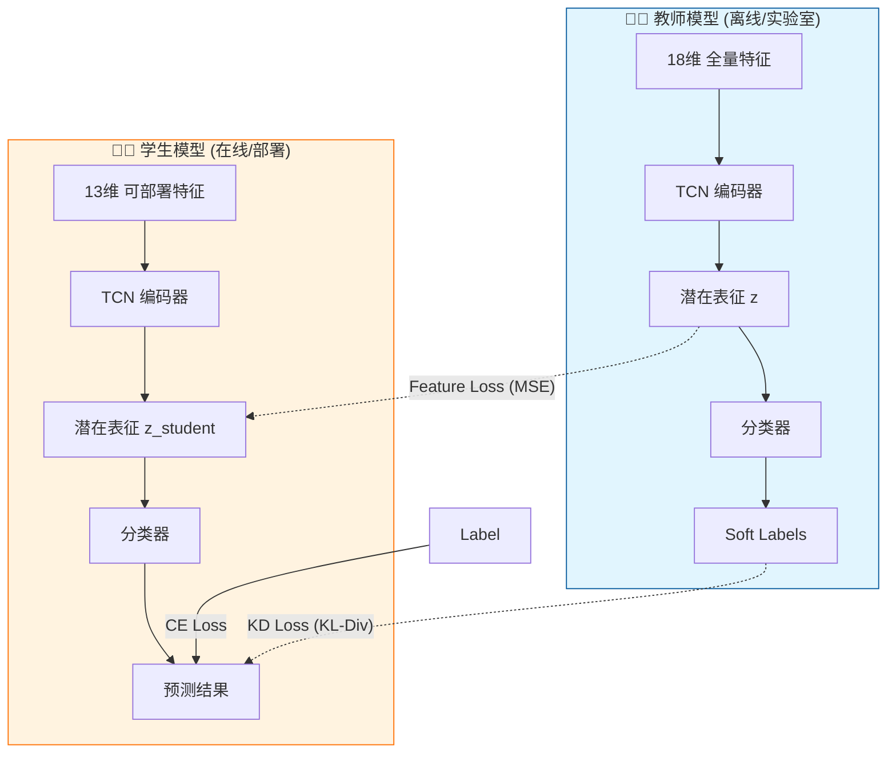
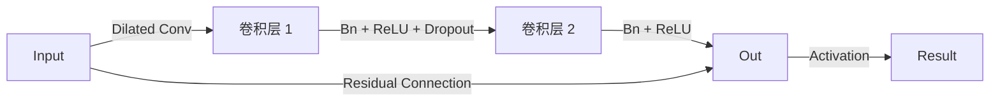

# ⚡ 焊缝质量智能诊断与知识蒸馏系统
### Intelligent Weld Seam Quality Diagnosis & Distillation System


---

## 📖 项目概述 (Overview)

本项目构建了一个基于 **时序卷积网络 (TCN)** 的高精度焊缝质量实时分类系统。针对工业场景中部分传感器（如高精度激光、红外）难以在线部署的痛点，我们创新性地引入了 **LUPI (Learning Using Privileged Information)** 知识蒸馏框架。

### 核心亮点

*   **🎓 特权信息蒸馏**: 教师模型利用全量特征（18维）学习复杂模式，指导仅有可部署特征（13维）的学生模型，实现"低配输入，高配性能"。
*   **🌊 时序卷积网络**: 采用空洞卷积（Dilated Convolution）捕捉长时序依赖，优于传统 RNN/LSTM。
*   **🛡️ 标签安全处理**: 严谨的数据预处理管线，杜绝时序泄漏和标签边界混淆。
*   **🔮 单调后处理**: 结合工业先验知识，通过动态规划（Dynamic Programming）强制输出状态的单调性演变（正常→预警→故障），大幅提升鲁棒性。

---

## 🏗️ 系统架构 (Architecture)

### 1. 知识蒸馏流程 (Knowledge Distillation)



### 2. TCN 残差块设计



---

## 📂 项目结构

```
PHOENIX-main/autoencoder_benchmark/
├── 📁 Data/                        # 数据中心
│   ├── 📄 raw_data/                # 原始CSV (a01.csv, b01.csv...)
│   └── 📦 processed_data/          # 高效 .npz 数据集
├── 📁 outputs/                     # 实验产物 (Checkpoints, Logs)
│
├── 🛠️ data_utils.py                # 基础工具库
├── ⚙️ prepare_weld_seam_dataset.py # 核心预处理: 窗口化 + 覆盖约束
├── 🧠 models_tcn.py                # 模型定义 (TCN Encoder + Classifier)
├── 🧪 framework.py                 # 蒸馏训练框架
│
├── 🚀 train_single_tcn_classifier.py         # 教师模型训练入口
├── 🎓 train_distill_single_tcn_student.py    # 学生蒸馏训练入口
│
├── 🔍 run_tcn_sweep.py             # 教师超参搜索
├── 🔍 run_distill_sweep.py         # 蒸馏超参搜索
│
├── 🔮 infer_with_monotonic_postprocess.py    # 推理与后处理
└── 📊 inspect_npz.py               # 数据探查工具
```

---

## 🏷️ 标签定义 (Labels)

| ID | 状态名称 | 英文标识 | 含义描述 | 图示 |
|:--:|:---|:---|:---|:--:|
| **0** | **准稳态** | `quasistable` | 焊接过程稳定，质量合格 | ✅ |
| **1** | **非稳态** | `nonstationary` | 过程出现波动，处于过渡期 | ⚠️ |
| **2** | **不稳定** | `instability` | 焊接失稳，可能产生缺陷 | ❌ |

---

## 🚀 快速开始 (Quick Start)

### 环境准备

```bash
pip install torch numpy pandas scikit-learn matplotlib
```

### 1. 数据预处理 (Preprocessing)

将原始 CSV 转换为无泄漏的滑动窗口数据集。
> **注意**: 必须确保 `input-dir` 指向正确的原始数据路径。

```bash
python prepare_weld_seam_dataset.py \
    --input-dir Data/raw_data \
    --output Data/processed_data/weld_seam_windows.npz \
    --window-size 5 \
    --stride 1 \
    --train-frac 0.75 \
    --purge-gap 0
```

### 2. 训练教师模型 (Train Teacher)

教师模型拥有全知视角（使用所有特征）。

```bash
python train_single_tcn_classifier.py \
    --dataset-npz Data/processed_data/weld_seam_windows.npz \
    --output-dir outputs/teacher_run \
    --epochs 50 \
    --lr 1e-4 \
    --batch-size 96 \
    --tcn-kernel 3 \
    --tcn-layers 3 \
    --class-weights auto \
    --seed 42
```

### 3. 知识蒸馏 (Distillation)

学生模型模仿教师，同时去除特权特征（默认去除 index 3-7）。

```bash
python train_distill_single_tcn_student.py \
    --dataset-npz Data/processed_data/weld_seam_windows.npz \
    --teacher-ckpt outputs/teacher_run/best_single_tcn.pth \
    --teacher-run-args outputs/teacher_run/run_args.json \
    --output-dir outputs/distill_run \
    --drop-feature-indices 3,4,5,6,7 \
    --temperature 2.0 \
    --lambda-ce 1.0 \
    --lambda-kd 0.5 \
    --lambda-feat 0.2
```

### 4. 推理与后处理 (Inference)

应用**单调解码**修正预测结果，消除抖动。

```bash
python infer_with_monotonic_postprocess.py \
    --dataset-npz Data/processed_data/weld_seam_windows.npz \
    --checkpoints outputs/teacher_run/best_single_tcn.pth \
    --decode both
```

---

## 🏆 最佳实验记录 (Best Record)

本项目展示了教师模型（全量特征）与学生模型（受限特征+蒸馏）的卓越性能。通过 LUPI 蒸馏，学生模型在缺失 5 维特权特征的情况下，依然保持了极高的预测精度和教师一致性。

### 1. 核心指标对比 (Model Comparison)

| 指标项目 | 教师模型 (18D Full) | 学生模型 (13D Deploy) | 说明 |
|:---|:---:|:---:|:---|
| **测试集准确率 (Test Acc)** | **98.64%** | **95.92%** | 整体分类准确度 |
| **教师一致性 (Agreement)** | 100% (Ref) | **96.20%** | 学生对教师逻辑的还原度 |
| **宏观 F1 (Macro-F1)** | **0.9828** | **0.9474** | 类别平衡后的综合性能 |
| **最优 Epoch (Best Epoch)** | 2 | 4 | 模型收敛速度 |

### 2. 最佳超参数配置 (Configurations)

<details>
<summary>点击查看 教师模型 (Teacher) 配置</summary>

```json
{
  "model": "tcn_attn",
  "input_dim": 18,
  "tcn_layers": 3,
  "tcn_channels": "80,80,80",
  "tcn_kernel": 3,
  "latent_dim": 64,
  "attn_heads": 4,
  "lr": 0.00025,
  "weighted_sampler": true
}
```
</details>

<details>
<summary>点击查看 学生模型 (Student) 配置</summary>

```json
{
  "input_dim": 13,
  "temperature": 3.0,
  "lambda_ce": 0.8,
  "lambda_kd": 1.2,
  "lambda_feat": 0.2,
  "lr": 0.0002,
  "weighted_sampler": true
}
```
</details>

### 3. 测试集分类报告 (Student Detailed Report)

*展示学生模型 (13D) 在实际部署场景下的详细表现：*

```text
              precision    recall  f1-score   support
     Class 0     1.0000   0.8902     0.9419        82
     Class 1     0.9000   0.9310     0.9153        87
     Class 2     0.9707   1.0000     0.9851       199

    accuracy                       0.9592       368
```

---

## 🔬 进阶功能

### 超参数搜索 (Hyperparameter Sweep)

| 任务 | 脚本 | 关键参数 |
|---|---|---|
| **TCN 结构搜索** | `run_tcn_sweep.py` | `lambda_align`, `lambda_kl` |
| **蒸馏权重搜索** | `run_distill_sweep.py` | `lambda_kd`, `lambda_feat` |

### 数据集探查

```bash
python inspect_npz.py
```
*输出样本分布统计及预览 CSV，确保存储格式正确。*

---

## 📊 数据格式说明

| 键名 (Key) | 维度 (Shape) | 说明 |
|---|---|---|
| `X_train_full` | `[N, T, 18]` | 原始全量特征窗口 |
| `seam_id_train` | `[N]` | 样本所属焊缝 ID |
| `start_idx_train` | `[N]` | 窗口在原始序列中的起始时间点 |
| `seam_name_order` | `[M]` | 焊缝 ID 与文件名的映射表 |
